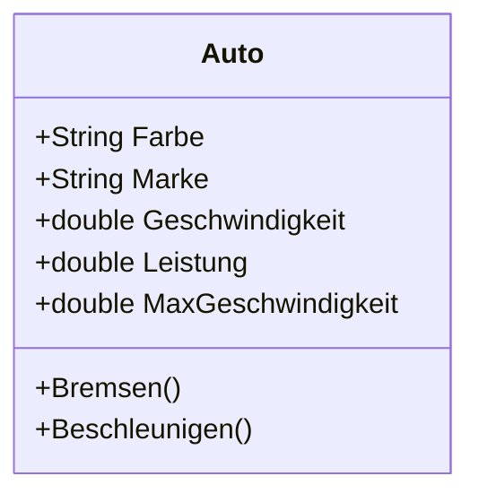

# Autorennen
## Inhalt
Testprojekt für die Schule zwecks Klassen und Konstruktoren. 

Datum | Änderung | Autor
-- |-- | --
12.04.24 | Erstellung Repo | Hendrik
12.04.24 | Veränderung README | Hendrik

## Testbild in Repo

