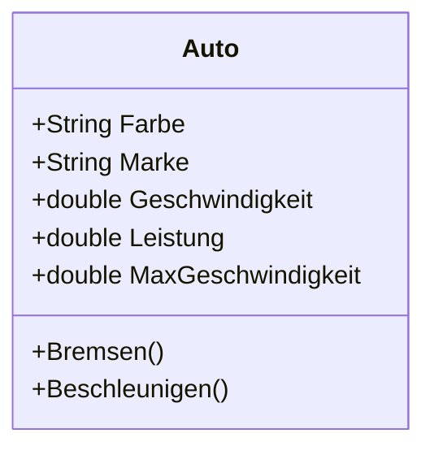

# Autorennen
## Inhalt
Testprojekt für die Schule zwecks Klassen und Konstruktoren. 

Datum | Änderung | Autor
-- |-- | --
12.04.24 | Erstellung Repo | Hendrik
12.04.24 | Veränderung README | Hendrik

## Testbild in Repo

## Funktionsbeschreibung
### Programm.cs
Die __using__ Anweisungen importieren verschiedene Namespaces, die für die Anwendung benötigt werden

__namespace Rennen__ Definiert den Namespace Rennen zur Organisation des Codes und zur Vermeidung von Namenskollisionen.

__internal static class Program__ Definiert eine statische Klasse Program, die nur innerhalb desselben Assemblys sichtbar ist. Diese Klasse enthält den Einstiegspunkt der Anwendung.

__[STAThread]__ Ein Attribut, das angibt, dass die COM-Threads (Component Object Model) im Single-Threaded Apartment (STA) Modus ausgeführt werden sollen. Dies ist erforderlich für Windows Forms-Anwendungen.

__static void Main()__ Die Hauptmethode der Anwendung. Dies ist der Einstiegspunkt, wenn die Anwendung gestartet wird.

__Initialisierungen in der Hauptmethode__
+ __Application.EnableVisualStyles()__ Aktiviert visuelle Stile für die Anwendung, um das Aussehen und Verhalten der Steuerelemente der Anwendung an das Betriebssystem anzupassen.
+ __Application.SetCompatibleTextRenderingDefault(false)__ Legt fest, dass neue Steuerelemente die Standard-Textwiedergabe verwenden sollten, die mit GDI (Graphics Device Interface) kompatibel ist. Diese Methode sollte nur einmal aufgerufen werden, bevor Steuerelemente erstellt werden.
+ __Application.Run(new Form1())__ Startet die Anwendung und öffnet das Hauptformular (Form1). Form1 muss eine Klasse sein, die von Form erbt und das Hauptfenster der Anwendung darstellt.

### Form1.cs
__publik Form1()__
+ Konstruktor __Form1__, in dieser Methode wird die Benutzeroberfläche konfiguriert  
+ Ausgabe des Strings __autoVW.ToString()__ (siehe Auto.cs)

__new Auto, new Person__ Erstellung der jeweiligen Objekte

__private void btnEinsteigen_Click__ Beim Drücken des Buttons werden die auf der Oberflaeche ausgewaehlten Personen über die Funktion __Einsteigen__ dem Objekt Auto uebergeben

__private void btnAussteigen_Click__ Beim Drücken des Buttons werden die auf der Oberflaeche ausgewaehlten Personen über die Funktion __Aussteigen__ dem Objekt Auto uebergeben 

### Person.cs
Definition der oeffentlichen Klasse __Person__

__public Person(string name, double gewicht)__ Konstruktor der __Person__ Klasse. Wird aufgerufen wenn eine neue Instanz erstellt wird.
+ __this.Name = name__ Weist dem uebergebenen "name" Parameter der privaten __name__ Eigenschaft zu
+ __this.Gewicht = gewicht__ Weist dem uebergebenen "gewicht" Parameter der privaten __gewicht__ Eigenschaft zu

__Oeffentliche Methoden__
+ __public double__ /__Gewicht__/__Name__, oeffentliche Methode, ermoeglicht den Zugriff auf das private Feld von außen, indem es den Parameter zurueckgibt.
+ __public override string ToString()__,  ueberschreibt die __ToString__ Methode der Basisklasse. Gibt den Namen und das Gewicht in einer Zeichenfolge zurueck.

### Auto.cs
__private__ Variablen um verschiedene Parameter zu speichern
+ __private List<Person> personenImAuto__ Liste, speichert die Personen, welche sich im Auto befinden.

__Oeffentliche Methoden__
+ __public Auto__ weist den __private__ Variablen die uebergebenen Variablen zu. Erstellt leere Liste.
+ __Einsteigen__ fuegt der Liste die uebergebene Persone zu, soweit die Max. Anzahl nicht ueberschritten ist
+ __Aussteigen__ löscht die uebergebene Person aus der Liste, soweit die Min. Anzahl nicht unterschritten wird.
+ __GesamtGewichtBerechnen__ addiert das Gewicht der sich in der Liste befindenen Personen und gibt das Gesamtgewicht zurück.
+ __GetPassagiere__ gibt eine Zeichenkette zurück, die die Personen tabellarisch aufzählt, welche sich im Auto befinden.
+ __public override string ToString()__,  ueberschreibt die __ToString__ Methode der Basisklasse. Gibt den Namen und das Gewicht in einer Zeichenfolge zurueck.

