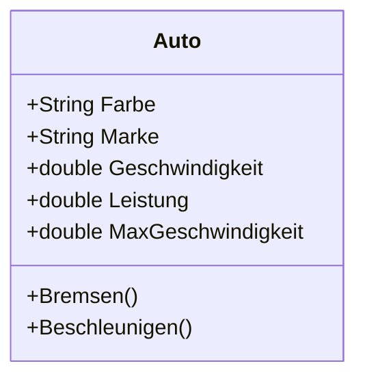
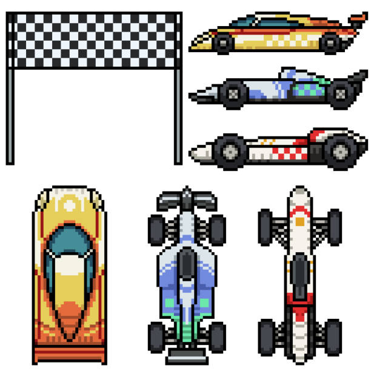

# Autorennen
## Inhalt
Testprojekt für die Schule zwecks Klassen und Konstruktoren. 

Klasse **Auto** beinhaltet folgende Eigenschaften:
+ Marke
+ Farbe
+ Gewicht
+ Leistung
+ Geschwindigkeit
+ Maximale Geschwindigkeit

Und folgende **Methoden**:
+ Bremsen
+ Beschleunigen
+ Start
+ Stop

## Testbild in Repo

